# Bob's Burgers API

Use this Bob's Burgers API to get information about your favorite characters and their best quotes or to add, update, or delete characters and quotes.

## Getting Started

1. Clone the repository with:
```zsh
git clone https://github.com/kangjoa/api-project.git
```

2. Install dependencies:
```zsh
npm install
```

3. Run the server in development mode:
```zsh
nodemon server
```

## Authentication and Authorization
Users must sign up and log in with a valid username and password in order to use the API.

| Method | Endpoint | Purpose |
| -------- | -------- | -------- |
| POST | `/sign-up` | Create an account |
| POST | `/login` | Get access to API with valid credentials |

### Sign-up
Make a `POST` request to `/sign-up` with a `username` and `password`.
```json
{
    "username": "a_username",
    "password": "a_password"
}
```
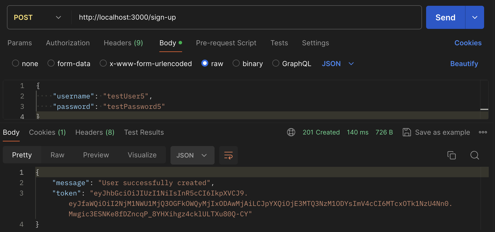

### Login
Make a `POST` request to `/login` with a `username` and `password`.
```json
{
    "username": "a_username",
    "password": "a_password"
}
```
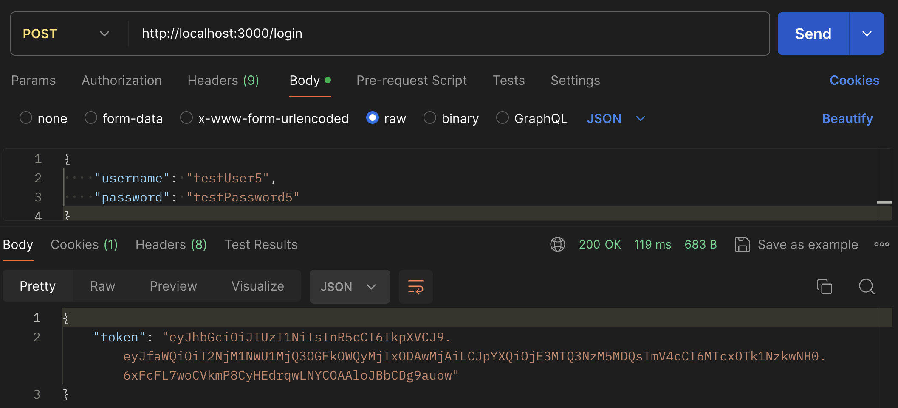


## Characters
| Method | Endpoint | Purpose |
| -------- | -------- | -------- |
| GET | `/characters` | Show all characters |
| GET | `/characters/:characterId` | Show one character by ID |
| POST | `/characters` | Create a character |
| PUT | `/characters/:characterId` | Update a character |
| DELETE | `/characters/:characterId` | Delete a character |

### Show all characters
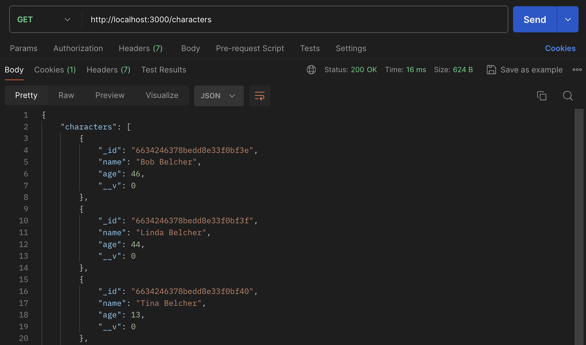

### Show one character
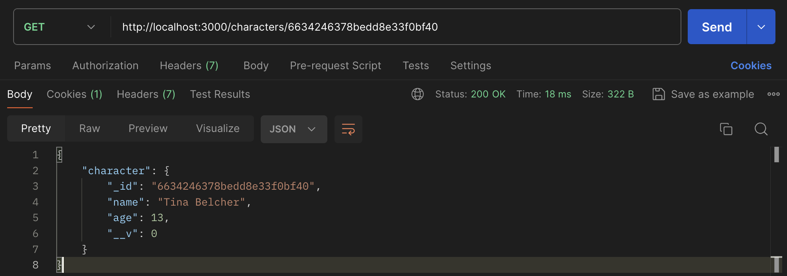

### Create a character
Make a `POST` request to `/characters`.
```json
{
  "name": "New character name",
  "age": number
}
```
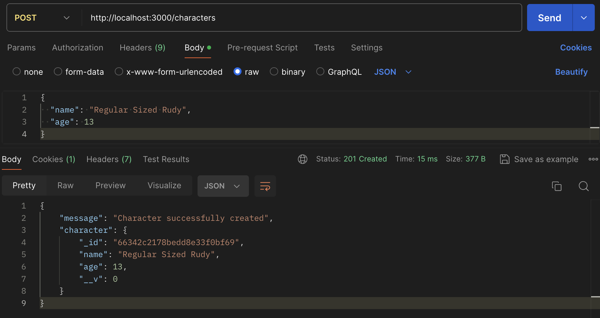

### Update a character
Make a `PUT` request to `/characters/:characterId` to update character attributes.
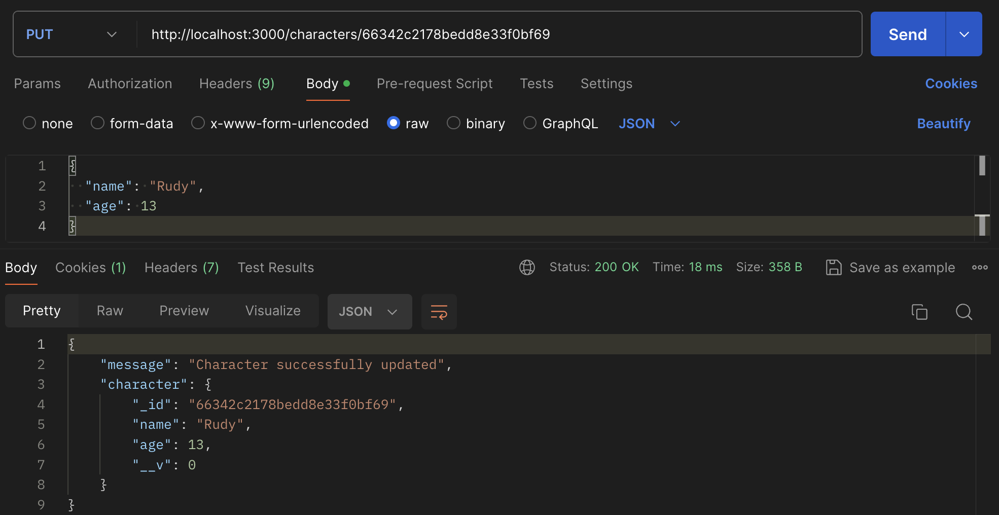

### Delete a character
Make a `DELETE` request to `/characters/:characterId` to delete a character.
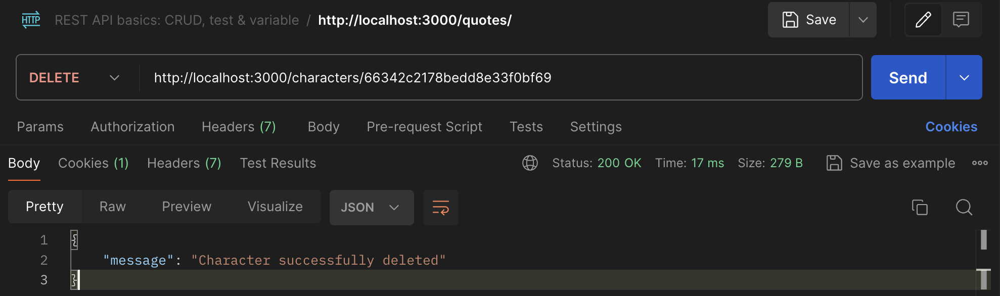

## Quotes

| Method | Endpoint | Purpose |
| -------- | -------- | -------- |
| GET | `/quotes` | Show all quotes |
| GET | `/quotes/:quoteId` | Show one quote by ID |
| POST | `/quotes` | Create a quote |
| PUT | `/quotes/:quoteId` | Update a quote |
| DELETE | `/quotes/:quoteId` | Delete a quote |

### Show all quotes
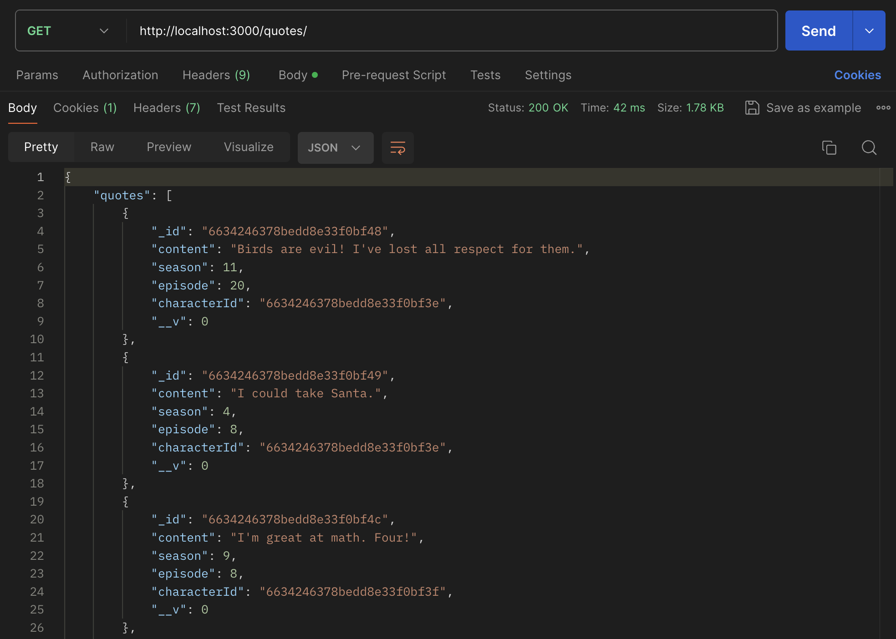

### Show one quote
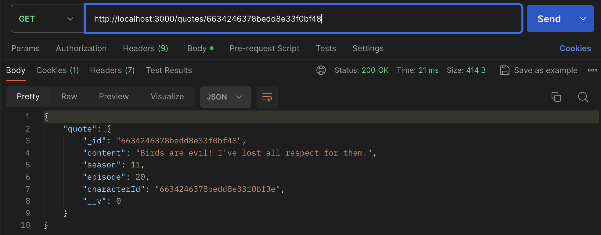

### Create a quote
Make a `POST` request to `/quotes`. A quote must be associated with an existing character so create a character before creating the new quote.
```json
{
  "content": "Quote content",
  "season": number,
  "episode": number,
  "characterId": "id for an existing character"
}
```
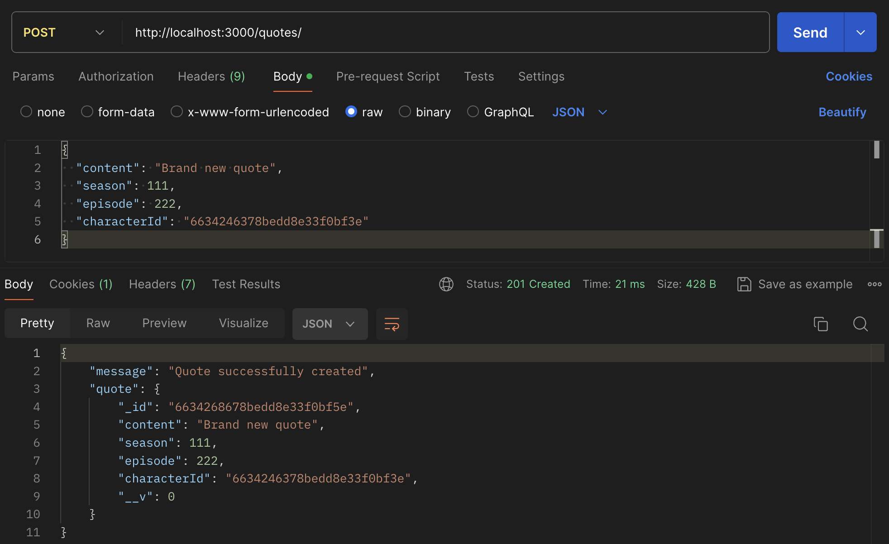

### Update a quote
Make a `PUT` request to `/quotes/:quoteId` to update quote attributes.
```json
{
  "content": "Updated quote content",
  "season": updated number,
  "episode": updated number,
  "characterId": "id for an existing character"
}
```
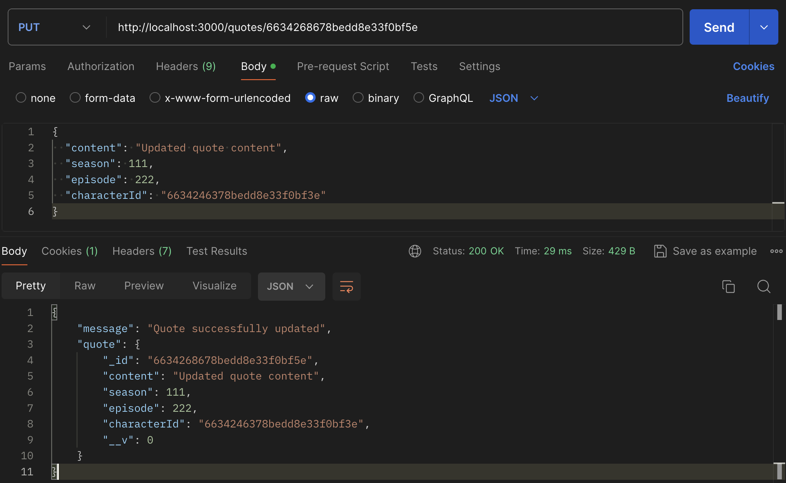

### Delete a quote
Make a `DELETE` request to `/quotes/:quoteId` to delete a quote.

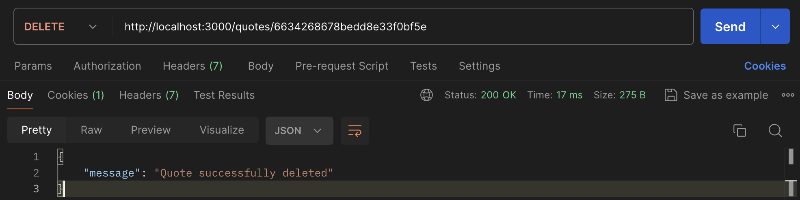